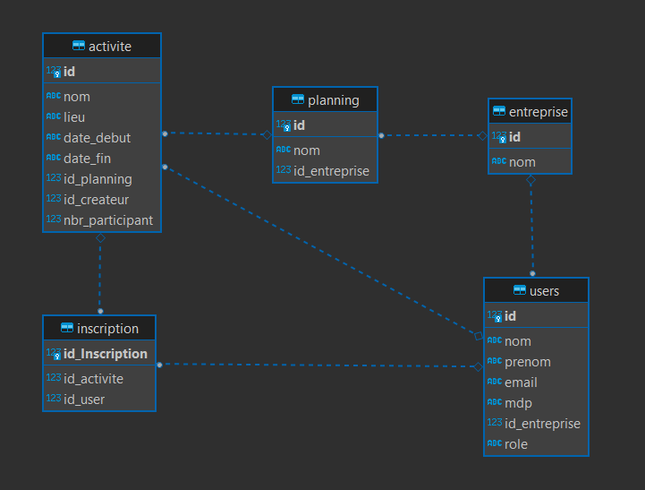
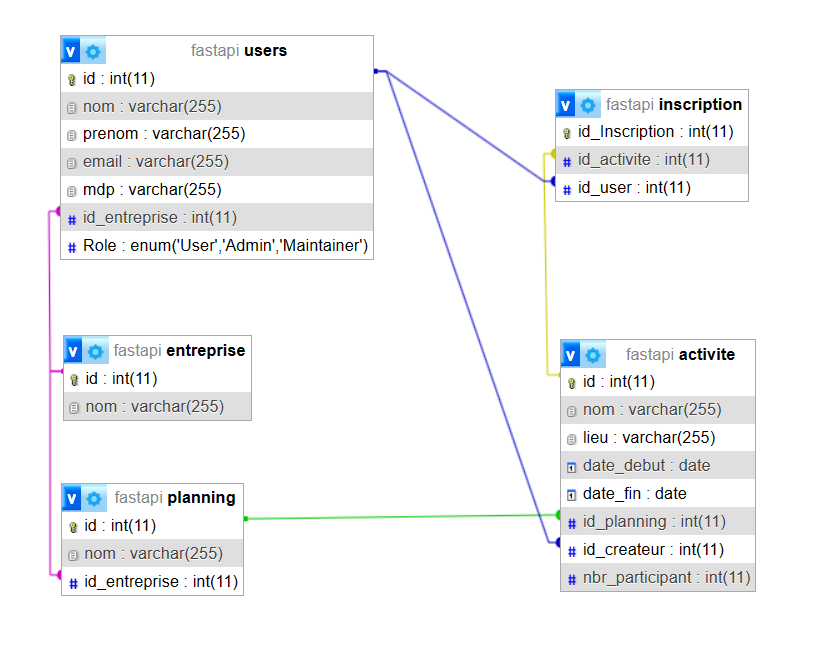

# ProjectFastAPI

Projet final du cours Développement web back - fullstack avec M. POISOT à EFFICOM.

## Fonctionnalités
C'est une application back-end permettant de :
- Gérer des utilisateurs,
- Gérer des entreprises,
- Gérer des planning,
- Gérer des acitités,
- Gérer des inscription des activités.

## Technologies utilisées
- FastAPI
- Python
- Docker
- Dockerfile

## Dépendances
- FastAPI 0.95.0
- python-multipart 0.0.6
- python-jose 3.3.0
- SQLAlchemy 1.4.23 
- cryptography 40.0.2

## Licences
- FastAPI
- SQLAlchemy
- Python
- python-multipart
- python-jose
- cryptography

## Documentation Swagger
La documentation est automatiquement disponible sur FQDN:port/docs/ ou /redoc.
Le FQDN par défaut est localhost et le port par défaut est 80.

## Exécuteion de l'application
2 modes possibles pour lancer l'application, celui recommandé est le mode Docker.
Une fois lancée, l'application sera accessible à http://localhost sauf si vous utilisez ce port pour autre chose.

### Mode Docker
Prérequis : docker et docker-compose installés
Pour se lancer, votre terminal doit être à la racine de ce dossier.
Puis exécuter la commande suivane :
docker-compose up --build

### Mode Uvicorne
Prérequis : python3.10 ou supérieur installé
Tout d'abord, installez les dépendances:
pip install -r requirements.txt

Ensuite, lancez l'application :
uvicorn main:app --host 0.0.0.0 --port 80

## Authentification

## Base de données

Par défaut, la base de données est sqlite. 
Il est recommandé de l'utiliser avec des données testables.
Mais, vous pouvez toujours utiliser une autre base de données si vous le souhaitez.

La base de données se trouve dans le dossier /app et son nom par défaut est fastapi.db.
Les tables sont vides par défaut et interaigie selon les actions faites dans les CRUD de l'application.

### Modèle Entité Association (MEA)

### Concepteur de la base de données

